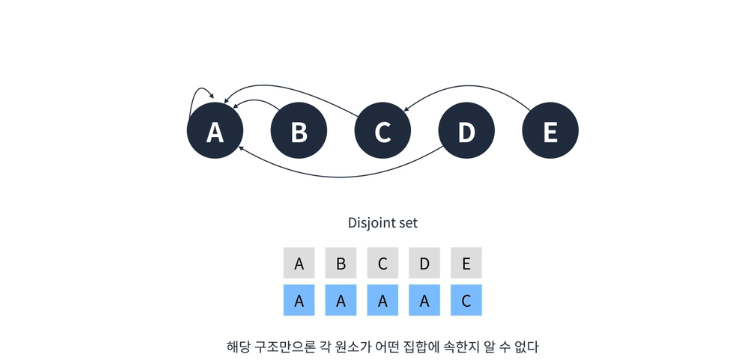
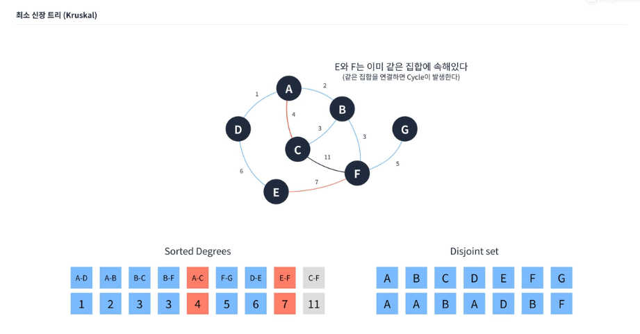

최단경로 알고리즘

### DFS, BFS

=> 간선 가중치가 모두 같아야 한다

### 다익스트라 알고리즘

=> 간선 가중치가 있고, 각 가중치가 모두 다를때 쓴다
=> 우선순위 큐를 이용해서 만들 수 있다.
시간복잡도: 간선의 수 \* log정점의 수

알고리즘 설명:
시작점 제외한 모든 정점의 거리는 무한으로 설정한다. 최단 거리를 구해야 하기 때문
시작점은 0으로 설정한다.
시작점을 정한다.

- 선택한 정점에서 갈 수 있는 정점까지의 거리 = 해당정점까지의 최단거리 + 간선 값으로 갱신
- 선택한 정점은 방문 처리.
- 이미 방문한 정점과 무한인 정점을 제외하고 가장 최단거리인 정점을 선택한다.
  더 이상 방문할 수 있는 정점 없을 때까지 \*을 반복
  도착점의 값을 확인한다.

### 벨만포드

### 플로이드 와샬

## 최소신장트리 (크루스칼 알고리즘)

최소 신장 트리란 모든 정점을 최소한의 간선만을 써서 모두 이어준 형태의 그래프를 말한다.
이런 트리를 만들려면 필요한 간선 외에는 모두 제거해주면 된다

- 최소한의 간선으로 모든 정점을 연결해야 하며,
- 모든 신장 트리 중 가중치의 값이 최소여야 한다.
- 사이클이 있어서는 안된다.

이런 알고리즘에는 크루스칼(Kruscal), 프림(Prim)이 있다

관련 개념:
그리디 개념을 사용해야 한다.
먼저 모든 그래프를 부분집합으로 분리를 한다
다음으로 가장 가중치 낮은 간선을 택하고 부분집합을 연결한다.
이때 사이클이 발생하지 않도록 주의해야 한다.
이는 공통 최상위 부모를 찾는 것으로 막을 수 있는데, 사이클을 판단하기 위해 union find 알고리즘을 쓸수있다.

union find 알고리즘?
서로소 집합을 구하는 알고리즘이다.
공통원소가 없는 두 집합을 표현하는 자료구조이다.

이는, 서로 다른 두 집합을 병합하는 연산 union과
집합의 원소가 어떤 집합에 속해있는지 판단하는 연산 find를 의미한다.
트리 구조로 구성하며, 편의상 재귀로 구현하는게 흔하다.(부모를 계속 찾아야 하기 때문이다)

union 연산:
초기에는 자기자신을 부모정점으로 지정한다.

이와 같이 부모의 부모를 하단 라인에 표시를 해준다.
=> 그림 없이는 관계 파악 어려움
=> 그래서 find 알고리즘이 필요하다: 간단하게는 부모가 자기자신일때까지 계속 올라가면 되지만 빠른 성능은 아니다.(o(N))
=> 경로 압축으로 해결: 재귀! - 어차피 타고 올라가다보면 부모 찾는 건 똑같다는 원리다.
재귀로 구현했다면, 돌아오면서 부모값을 변경해준다. => 자연스레 경로가 최적화 된다. (상수시간으로 부모 찾을 수 있음)

간선 배열과 서로소 집합 배열을 준비해놓고,
가장 낮은 가중치를 가진 A-D 간선을 택해서 시작한다.
사이클이 발생하는 간선의 경우 PASS를 해두고 표시해둔다

PASS 한 간선만 제거해두면, 최소신장 트리가 완성된다.
